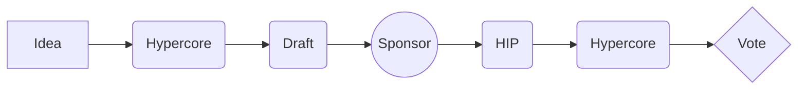
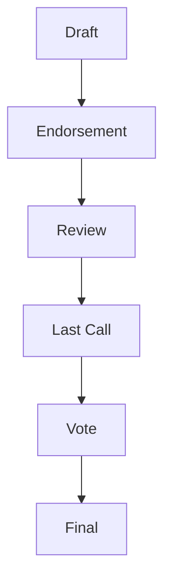



hip: 1

title: HIP Purpose and Guidelines

status: Living

type: Process

author: Mathias Goldmann <mathias@constellationnetwork.io>, et al.

created: 2022-11-08

  
  

## what-is-an-HIP) What is an HIP?

  

HIP stands for Hypergraph Improvement Proposal. It is a design document that describes a new feature, process or information to the community of the Constellation Hypergraph Transfer Protocol. The HIP should contain a concise technical specification of the proposed feature as well as a rationale for the feature. The author of an HIP is responsible to find a sponsor, get feedback and improve upon the proposal and to find consensus in the community. Furthermore, the author is to document the process of pro and contra arguments for their HIP on www.Hypercore.org.

  

## HIP_rationale) HIP Rationale

  

The HIP Process is heavily inspired by the successful decentralized governance systems of Bitcoin and Ethereum (BIP/EIP). It serves as the mechanism to propose changes and improvements to the protocol code base, the protocol environment and inform the community on design decisions and best practices. The HIPs are maintained as text files in a versioned [repository](https://github.com/Constellation-Labs/HIPs) on Github, their revision history is the historical record of the proposal.

  
  

## s) HIP Types

  

There are three types of HIPs:

A **Standards Track** HIP describes changes that affect most or all HGTP implementations such as—a change to the network protocol, a change in snapshot or transaction validity rules, proposed application standards/conventions, or any change or addition that affects the interoperability of applications using the HGTP. Standards Track HIPs consist of three parts—a design document, an implementation, and (if warranted) an update to the [formal specification](https://github.com/ethereum/yellowpaper). Furthermore, Standards Track HIPs can be broken down into the following categories:

  

- **Core**: improvements that may or may not require a consensus fork as well as changes that are not necessarily consensus critical but may be relevant core dev miner/node strategy changes. This covers all aspects of client implementations, ACIs and L_0 improvements.  
  
- **HRC**: application-level standards and conventions, including contract standards such as token standards ([HIP-42](https://www.notion.so/NTT42-State-Channel-09b0f4acad6542bab9beb9dafdc14108), name registries, URI schemes, library/package formats, and wallet formats.

  

A **Process** HIP describes a process surrounding the HGTP or proposes a change to (or an event in) a process. Process HIPs are like Standards Track HIPs but apply to areas other than the HGTP protocol itself. They may propose an implementation, but not to the HGTP codebase; they often require community consensus; unlike Informational HIPs, they are more than recommendations, and users are typically not free to ignore them. Examples include procedures, guidelines, changes to the decision-making process, and changes to the tools or environment used in Hypergraph development.

  

**Informational** HIP describes a Hypergraph design issue, or provides general guidelines or information to the Constellation community. It does not propose a new feature. Informational HIPs do not necessarily represent the Constellation community consensus or a recommendation, so users and implementers are free to ignore Informational HIPs or follow their advice.

  

It is highly recommended that a single HIP contain a single key proposal or new idea. The more focused the HIP, the more successful it tends to be. A change to one client doesn’t require an HIP; a change that affects multiple clients, or defines a standard for multiple apps to use, does.

  

An HIP must meet certain minimum criteria. It must be a clear and complete description of the proposed enhancement. The enhancement must represent a net improvement. The proposed implementation, if applicable, must be solid and must not complicate the protocol unduly.

  

## hip_workflow) HIP Workflow

  

Relevant parties involved in the process are you, the champion or _HIP author_, the HIP sponsors and the Hypergraph Core Developers.

  

Before you begin writing a formal HIP, you should vet your idea. Ask the Constellation community first if an idea is original to avoid wasting time on something that will be rejected based on prior research. It is thus recommended to open a discussion thread on the Hypercore forum. As a secondary means the Constellation Governance Discord channel can be addressed. All main threads and arguments from Discord should be linked back to the Hypercore thread as a means of tracking an idea or HIP in one place and creating a history around the HIP idea.

  

Once the idea has been vetted, your next responsibility will be to present the idea to the potential sponsors and all interested parties (community, developers) on the aforementioned channels. You need a sponsor to progress your idea to an actual HIP draft. A sponsor supports the editing of your HIP and assigns a formal HIP number to it. All Hypergraph stakeholder groups (Core Developers, L0 Projects, Node Operators, Foundation) have appointed sponsors you can contact.

Make sure that your HIP is in line with the general ethics and spirit of the Hypergraph. Try and gauge whether the interest in your HIP is commensurate with both the work involved in implementing it and how many parties will have to conform to it. For example, the work required for implementing a Core HIP will be much greater than for an HRC and the HIP will need sufficient interest from the Hypergraph Core developers. Negative Sponsor and community feedback will be taken into consideration and may prevent your HIP from moving past the Draft stage.

  

Once the HIP has found a sponsor, is fully formulated, and has decent community support, the HIP sponsor moves the HIP forward to a full community vote on the Lattice.is platform. There, all $DAG token holders may vote on the HIP.  
  

## process_hips) Process HIPs,  
  
must include an assessment of the impact the HIP will have and the possible outcomes for the network and ecosystem. While it is impossible to model all possible scenarios, the author must demonstrate a thorough impact assessment before a sponsor may move the HIP into a community vote.

  

## [hips.](https://hypercore.org/HIPS/Hip-1#style-guide)[hypercore.org/HIPS/Hip-1#core_hips](https://hypercore.org/HIPS/Hip-1#core_hips)) Core HIPs

  

For Core HIPs, given that they require client implementations to be considered **Final** (see “HIPs Process” below), you will need to either provide an implementation for clients or convince clients to implement your HIP.

  

The best way to get client implementers to review your HIP is to present it on an CoreDevs call. You can request to do so by posting a comment linking your HIP on an [AllCoreDevs agenda GitHub Issue]

  

The CoreDevs call serves as a way for client implementers to do four things. First, to discuss the technical merits of HIPs. Second, to win a core dev sponsor for your HIP. Third, gauge what other clients will be implementing. Fourth, to coordinate HIP implementation for network upgrades.

  

:warning: Presenting on CoreDevs still requires you to find a sponsor for your HIP and a final community vote to implement the HIP. All non-technical issues and implications of a technical change to the core protocol should be discussed on Hypercore and Discord not on the CoreDev call. Make sure as a Champion and of an HIP to link all relevant documents, links and arguments representing various stakeholders to your HIP thread on Hypercore. This will make assessment of consensus easier.

  

*Your role as a champion is to write the HIP using the style and format described below, find a sponsor in the relevant forums and build consensus around your idea. The Sponsor will support and help edit the proposal and will forward it to a full community vote once the quality and rough consensus criteria are met.*

  

## [hips.](https://hypercore.org/HIPS/Hip-1#style-guide)[hypercore.org/HIPS/Hip-1#HIP_process](https://hypercore.org/HIPS/Hip-1#HIP_process)) HIP Process

  

**Idea** - An idea that is pre-draft. This is not tracked within the HIP Github Repository. Ideas are usually expressed on Hypercore and Discord.

  

**Draft** - The first formally tracked stage of an HIP in development. An HIP is merged by an HIP Sponsor into the HIP repository when properly formatted.

  

**Review** - An HIP Author marks an HIP as ready for and requesting Peer Review.

  

**Last Call** - This is the final review window for an HIP before moving to `Final`. An HIP editor will assign `Last Call` status and set a review end date (`last-call-deadline`), typically 14 days later.

  

If this period results in necessary normative changes it will revert the HIP to `Review`.

  

**Final** - This HIP represents the final standard. A Final HIP exists in a state of finality and should only be updated to correct errata and add non-normative clarifications.

  

**Stagnant** - Any HIP in `Draft` or `Review` or `Last Call` if inactive for a period of 6 months or greater is moved to `Stagnant`. An HIP may be resurrected from this state by Authors or HIP Editors through moving it back to `Draft` or it’s earlier status. If not resurrected, a proposal may stay forever in this status.

  

**Withdrawn** - The HIP Author(s) have withdrawn the proposed HIP. This state has finality and can no longer be resurrected using this HIP number. If the idea is pursued at later date it is considered a new proposal.

  

**Living** - A special status for HIPs that are designed to be continually updated and not reach a state of finality. This includes most notably HIP-1.

  

## templates) HIP Formats and Templates

  

HIPs should be written in [markdown](https://github.com/adam-p/markdown-here/wiki/Markdown-Cheatsheet) format. There is a [template](https://github.com/ethereum/EIPs/blob/master/eip-template.md) to follow.

  

## [hips.](https://hypercore.org/HIPS/Hip-1#style-guide)[hypercore.org/HIPS/Hip-1#header](https://hypercore.org/HIPS/Hip-1#header)) HIP Header Preamble

  

Each HIP must begin with an [RFC 822](https://www.ietf.org/rfc/rfc822.txt) style header preamble, preceded and followed by three hyphens (`---`). This header is also termed [“front matter” by Jekyll](https://jekyllrb.com/docs/front-matter/). The headers must appear in the following order.

  

`hip`: _HIP number_ (this is determined by the HIP Sponsor)

  

`title`: _The HIP title is a few words, not a complete sentence_

  

`description`: _Description is one full (short) sentence_

  

`author`: _The list of the author’s or authors’ name(s) and/or username(s), or name(s) and email(s). Details are below._

  

`discussions-to`: _The url pointing to the official discussion thread_

  

`status`: _Draft, Review, Last Call, Final, Stagnant, Withdrawn, Living_

  

`last-call-deadline`: _The date last call period ends on_ (Optional field, only needed when status is `Last Call`)

  

`type`: _One of `Standards Track`, `Process`, or `Informational`_

  

`category`: _One of `Core`, `Networking`, `Interface`, or `ERC`_ (Optional field, only needed for `Standards Track` HIPs)

  

`created`: _Date the HIP was created on_

  

`requires`: _HIP number(s)_ (Optional field)

  

`withdrawal-reason`: _A sentence explaining why the HIP was withdrawn._ (Optional field, only needed when status is `Withdrawn`)

  

Headers that permit lists must separate elements with commas.

  

Headers requiring dates will always do so in the format of ISO 8601 (yyyy-mm-dd).

  

### `author` header

  

The `author` header lists the names, email addresses or usernames of the authors/owners of the HIP. Those who prefer anonymity may use a username only, or a first name and a username. The format of the `author` header value must be:

  

> Random J. User <address@dom.ain>

  

or

  

> Random J. User (@username)

  

if the email address or GitHub username is included, and

  

> Random J. User

  

if the email address is not given.

  

It is not possible to use both an email and a GitHub username at the same time. If important to include both, one could include their name twice, once with the GitHub username, and once with the email.

  

At least one author must use a GitHub username, in order to get notified on change requests and have the capability to approve or reject them.

  

### `discussions-to` header

  

While an HIP is a draft, a `discussions-to` header will indicate the URL where the HIP is being discussed.

  

The preferred discussion URL is a topic on [Hypercore](https://hypercore.org/). The URL cannot point to Github pull requests, any URL which is ephemeral, and any URL which can get locked over time (i.e. Reddit topics).

  

### `type` header

  

The `type` header specifies the type of HIP: Standards Track, Process, or Informational. If the track is Standards please include the subcategory (core, networking, interface, security or HRC).

  

### `category` header

  

The `category` header specifies the HIP’s category. This is required for standards-track HIPs only.

  

### `created` header

  

The `created` header records the date that the HIP was assigned a number. Both headers should be in yyyy-mm-dd format, e.g. 2001-09-17.

  

### `requires` header

  

HIPs may have a `requires` header, indicating the HIP numbers that this HIP depends on.

  

## external_resources) Linking to External Resources

  

Links to external resources **SHOULD NOT** be included. External resources may disappear, move, or change unexpectedly.

  

## [hips.](https://hypercore.org/HIPS/Hip-1#style-guide)[hypercore.org/HIPS/Hip-1#linking_hips](https://hypercore.org/HIPS/Hip-1#linking_hips)) Linking to other HIPs

  

References to other HIPs should follow the format `HIP-N` where `N` is the HIP number you are referring to. Each HIP that is referenced in an HIP **MUST** be accompanied by a relative markdown link the first time it is referenced, and **MAY** be accompanied by a link on subsequent references. The link **MUST** always be done via relative paths so that the links work in this GitHub repository, forks of this repository, the main HIPs site, mirrors of the main HIP site, etc. For example, you would link to this HIP as `./hip-1.md`.

  

## [hips.](https://hypercore.org/HIPS/Hip-1#style-guide)[hypercore.org/HIPS/Hip-1#HIPsponsors](https://hypercore.org/HIPS/Hip-1#HIPsponsors)) HIP Sponsors

  

The current Sponsors are:

  

Core Dev: Lukasz@constellationnetwork.io

L0 Projects: chandru@alkimi.org

Constellation Foundation: mathias@constellationnetwork.io

Node Operators: Doug@constellationnetwork.io

  

## [hips.](https://hypercore.org/HIPS/Hip-1#style-guide)[hypercore.org/HIPS/Hip-1#sponsor-responsibilities](https://hypercore.org/HIPS/Hip-1#sponsor-responsibilities)) HIP Sponsor Responsibilities

For each new HIP that comes in, sponsor does the following:

  

- Read the HIP to check if it is ready: sound and complete. The ideas must make technical sense, even if they don’t seem likely to get to final status.

- The title should accurately describe the content.

- Check the HIP for language (spelling, grammar, sentence structure, etc.), markup (GitHub flavored Markdown), code style

  

If the HIP isn’t ready, the editor will send it back to the author for revision, with specific instructions.

  

Once the HIP is ready for the repository, the HIP Sponsor will:

  

- Assign an HIP number (generally the PR number, but the decision is with the editors)

- Merge the corresponding [pull request](https://github.com/constellation/pulls)

- Send a message back to the HIP author with the next step.

  

Many HIPs are written and maintained by developers with write access to the Hypergraph codebase. The HIP sponsors monitor HIP changes, and correct any structure, grammar, spelling, or markup mistakes we see.

  

:warning: Unlike in Ethereum the sponsors evaluate the alignment of an HIP with the ethics, goals and long term vision of the Hypergraph. This serves to filter governance spam and unethical proposals.

  

## ) Style Guide

  

### ) Titles

  

The `title` field in the preamble:

  

- Should not include the word “standard” or any variation thereof; and

- Should not include the HIP’s number.

  

### [hips.](https://hypercore.org/HIPS/Hip-1#style-guide)[hypercore.org/HIPS/Hip-1#descriptions](https://hypercore.org/HIPS/Hip-1#descriptions)) Descriptions

  

The `description` field in the preamble:

  

- Should not include the word “standard” or any variation thereof; and

- Should not include the HIP’s number.

  

### [hips.](https://hypercore.org/HIPS/Hip-1#style-guide)[hypercore.org/HIPS/Hip-1#hip-numbers](https://hypercore.org/HIPS/Hip-1#eip-numbers)) HIP numbers

  

When referring to an HIP by number, it should be written in the hyphenated form `HIP-X` where `X` is the HIP’s assigned number.

  

### RFC 2119 and RFC 8174

  

HIPs are encouraged to follow [RFC 2119](https://www.ietf.org/rfc/rfc2119.html) and [RFC 8174](https://www.ietf.org/rfc/rfc8174.html) for terminology and to insert the following at the beginning of the Specification section:

  

> The key words “MUST”, “MUST NOT”, “REQUIRED”, “SHALL”, “SHALL NOT”, “SHOULD”, “SHOULD NOT”, “RECOMMENDED”, “NOT RECOMMENDED”, “MAY”, and “OPTIONAL” in this document are to be interpreted as described in RFC 2119 and RFC 8174.

  

## ) Resources

  

For core HIPs to be successful the author has to be able to develop and present a full reference implementation alongside the HIP. The expected positive outcome of an HIP for adoption and business case will generally suffice to justify time and resources spent on developing the HIP.

At the same time, the Constellation Foundation, the community DAO and L0 projects do support development of certain HIPs with their ecosystem and developer grants.

  
  
  

## ) Acknowledgement

  

Major input into this document has been drawn from Ethereums EIP-1 which in turn relied heavily on Bitcoins BIP-0001 and Pythons [Pep-0001](https://peps.python.org/). Thank you [Martin Becze](mailto:mb@ethereum.org) and [Hudson Jameson](mailto:hudson@ethereum.org) with [EIP-1](https://eips.ethereum.org/EIPS/eip-1) as well as Amir Taaki [BIP-0001](https://en.bitcoin.it/wiki/BIP_0001) for the spearheading work and best practices for successful blockchain governance! We adapted and altered according to our needs and in many places text was simply copied and modified.

  

As a living document the Hypergraph HIP-1 will evolve and change over time and become its own governance process exemplifying the unique technology and community of the Constellation Ecosystem.

  

## ) Citation  
  
Please cite this document as:

Mathias Goldmann et al "HIP Purpose and Guidelines" Hypergraph Improvement Proposal no.1 Nov 2022 [HIP](https://hips.hypercore.org/hip-1)

  

## ) Copyright

Copyright and related rights waived via [CC0](https://hips.hypercore.org/LICENSE).
